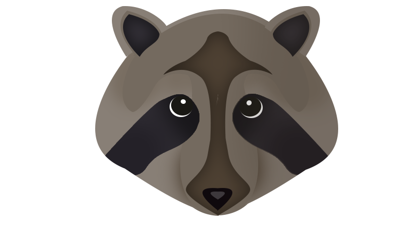

[logo]: assets/raccoon.png "Bijux's Logo"

<h1>Bijoux - Case study CSS Framework</h1>

## Hello humans!

Yes! Another CSS framework! But without difference from any other. This framework is only a case study :)

# WIP

- [x] Variables
    * Base colors, font-family, sizes, gaps and more.
- [x] Grid
    * Grid with four sizes: mobile, tablet, desktop and large screens
- [ ] Typography
- [ ] Buttons
- [ ] Lists
- [ ] Forms
- [ ] Codes
- [ ] Utilities
